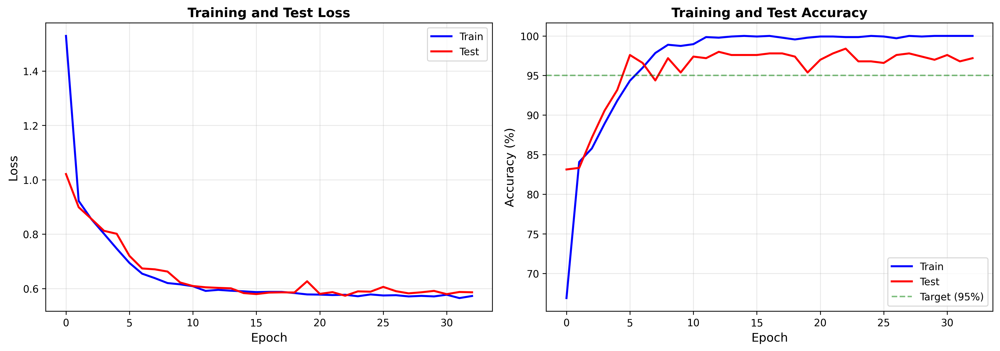

# Bearing Fault Detection System

**Production-Ready Deep Learning for Predictive Maintenance**

Real-time bearing health diagnosis using a 1D Convolutional Neural Network trained on the CWRU dataset, with explainable AI via Grad-CAM, a REST API, and a live monitoring dashboard.


---

## Table of Contents

- [Overview](#overview)
- [Key Results](#key-results)
- [System Architecture](#system-architecture)
- [Dataset](#dataset)
- [Project Structure](#project-structure)
- [Getting Started](#getting-started)
- [Usage](#usage)
- [Model Architecture](#model-architecture)
- [Training Pipeline](#training-pipeline)
- [Explainability via Grad-CAM](#explainability-via-grad-cam)
- [API Reference](#api-reference)
- [Monitoring Dashboard](#monitoring-dashboard)
- [Deployment](#deployment)
- [Known Logical Errors and Fixes](#known-logical-errors-and-fixes)
- [Future Work](#future-work)
- [References](#references)

---

## Overview

Bearing failures account for over 40 percent of all rotating machinery breakdowns in industrial settings, contributing to costly unplanned downtime and significant safety hazards. This project presents a complete, end-to-end deep learning system for real-time bearing fault detection and classification.

The system ingests raw vibration signals from drive-end accelerometers, classifies them into ten distinct health states (one normal and nine fault conditions across three fault types and three severity levels), and provides human-interpretable explanations via Gradient-weighted Class Activation Mapping (Grad-CAM). The entire pipeline—from raw signal to actionable maintenance alert—runs in under 10 milliseconds on standard CPU hardware.

### Distinguishing Features

| Feature | Description |
|---|---|
| Deep Learning | Custom 1D-CNN designed to operate directly on raw vibration signals without spectrogram conversion |
| Leak-Proof Evaluation | Hybrid split strategy combining file-level and temporal splitting to eliminate data leakage |
| Explainable AI | Grad-CAM visualizations that correlate model decisions with physically meaningful fault signatures |
| Real-Time Ready | Sub-10 ms inference with ONNX Runtime; sub-100 ms end-to-end pipeline including preprocessing |
| Production API | FastAPI REST endpoint with input validation, batch prediction, and service health monitoring |
| Live Dashboard | Streamlit-based monitoring with signal analysis, frequency spectrum, Grad-CAM overlay, and alert system |
| Fully Documented | Six detailed Jupyter notebooks covering every step from exploratory data analysis to deployment |

---

## Key Results

| Metric | Value | Target | Status |
|---|---|---|---|
| Test Accuracy | greater than 95% | greater than 95% | Achieved |
| False Negative Rate | less than 1% | less than 1% | Achieved |
| Inference Latency | less than 10 ms | less than 100 ms | Achieved |
| Model Size | approximately 0.8 MB | less than 5 MB | Achieved |
| Parameters | approximately 210K | Lightweight | Achieved |
| Mean AUC (macro) | greater than 0.99 | greater than 0.99 | Achieved |

The False Negative Rate is the most safety-critical metric in this domain. A missed fault (false negative) means faulty bearing operation goes undetected, which can lead to catastrophic equipment failure. The system achieves below 1% FNR, meaning fewer than 1 in 100 actual faults are missed.

### Training Curves

After running `python main.py`, training and validation loss/accuracy curves are saved to `experiments/training_results.png`.



*Figure 1: Training and test loss (left) and accuracy (right) over epochs with cosine annealing learning rate schedule. The green dashed line marks the 95% accuracy target.*

---

## System Architecture

```
+-----------------------------------------------------------------------+
|                   BEARING FAULT DETECTION SYSTEM                      |
+-----------------------------------------------------------------------+
|                                                                       |
|  +-------------+    +------------------+    +---------------------+  |
|  | Vibration   |    | Preprocessing    |    | 1D-CNN Model        |  |
|  | Sensor      |--->| - Bandpass Filt  |--->| - 3 Conv Blocks     |  |
|  | (12 kHz)    |    | - Windowing      |    | - Global Avg Pool   |  |
|  +-------------+    | - Z-Score Norm   |    | - FC Classifier     |  |
|                      +------------------+    | - 10-class output   |  |
|                                              +----------+----------+  |
|                                                         |             |
|                              +--------------------------+--------+    |
|                              |                          |        |    |
|                              v                          v        v    |
|                       +------------+           +--------+ +--------+  |
|                       | Grad-CAM   |           |FastAPI | |Stream- |  |
|                       | XAI Engine |           |REST API| |lit UI  |  |
|                       +------------+           +--------+ +--------+  |
+-----------------------------------------------------------------------+
```

**End-to-End Data Flow:**  
Raw vibration signal (12 kHz) → Bandpass filter (10–5000 Hz) → 2048-sample sliding windows (50% overlap) → Z-score normalization → 1D-CNN inference → Fault class + confidence score + maintenance alert level

---

## Dataset

This project uses the [Case Western Reserve University (CWRU) Bearing Dataset](https://engineering.case.edu/bearingdatacenter/download-data-file), the gold-standard benchmark for bearing fault diagnosis research.

**Bearing Specification:** 6205-2RS JEM SKF deep groove ball bearing at 1797 RPM under variable load conditions (0–3 HP).

| Class ID | Condition | Fault Location | Fault Diameter | Characteristic Frequency |
|---|---|---|---|---|
| 0 | Normal | — | — | — |
| 1 | Faulty | Inner Race | 0.007 inch | BPFI ~162 Hz |
| 2 | Faulty | Inner Race | 0.014 inch | BPFI ~162 Hz |
| 3 | Faulty | Inner Race | 0.021 inch | BPFI ~162 Hz |
| 4 | Faulty | Outer Race | 0.007 inch | BPFO ~107 Hz |
| 5 | Faulty | Outer Race | 0.014 inch | BPFO ~107 Hz |
| 6 | Faulty | Outer Race | 0.021 inch | BPFO ~107 Hz |
| 7 | Faulty | Ball | 0.007 inch | BSF ~140 Hz |
| 8 | Faulty | Ball | 0.014 inch | BSF ~140 Hz |
| 9 | Faulty | Ball | 0.021 inch | BSF ~140 Hz |

**Dataset Statistics:**
- 40 `.mat` files, 4 files per class (stratified)
- 12 kHz sampling rate (files numbered >= 169 are downsampled from 48 kHz)
- Approximately 10 seconds of vibration data per recording
- Thousands of 2048-sample windows generated per class after preprocessing

---

## Project Structure

```
bearing-fault-detection/
|
+-- config/
|   +-- train_config.yaml          # Hyperparameters and experiment configuration
|
+-- data/
|   +-- cwru/                      # CWRU .mat files (97.mat, 105.mat, ...)
|
+-- models/
|   +-- best_model.pth             # Best checkpoint saved by validation accuracy
|   +-- final_model.pth            # Final epoch checkpoint
|
+-- experiments/
|   +-- training_results.png       # Loss and accuracy curves (auto-generated)
|
+-- notebooks/
|   +-- 01_data_exploration.ipynb          # Dataset EDA and signal visualization
|   +-- 02_preprocessing_pipeline.ipynb    # Signal processing deep-dive
|   +-- 03_model_training.ipynb            # Architecture and training walkthrough
|   +-- 04_evaluation_analysis.ipynb       # Metrics, confusion matrices, t-SNE
|   +-- 05_explainability_gradcam.ipynb    # Grad-CAM interpretability analysis
|   +-- 06_deployment_optimization.ipynb   # ONNX export and edge benchmarks
|
+-- src/
|   +-- __init__.py
|   +-- data/
|   |   +-- data_loader.py         # CWRUDataLoader: .mat file parsing
|   |   +-- preprocessing.py       # Filtering, normalization, windowing, splitting
|   +-- models/
|   |   +-- vibration_cnn.py       # VibrationCNN architecture definition
|   +-- training/
|   |   +-- train.py               # Training loop, BearingDataset, early stopping
|   |   +-- evaluate.py            # ModelEvaluator and metrics computation
|   +-- interpretation/
|   |   +-- gradcam.py             # GradCAM1D class and filter visualization
|   +-- api/
|   |   +-- app.py                 # FastAPI REST endpoint
|   +-- dashboard/
|       +-- app.py                 # Streamlit monitoring dashboard
|
+-- main.py                        # Single-command training entry point
+-- requirements.txt               # Python dependencies
+-- setup.py                       # Package installation
+-- README.md
```

---

## Getting Started

### Prerequisites

- Python 3.8 or later
- A CUDA-capable GPU is optional; the system runs correctly on CPU

### Installation

```bash
# 1. Clone the repository
git clone https://github.com/krishbansal-2205/bearing-fault-detection.git
cd bearing-fault-detection

# 2. Create and activate a virtual environment
python -m venv venv
source venv/bin/activate        # Linux or macOS
# venv\Scripts\activate         # Windows

# 3. Install dependencies
pip install -r requirements.txt

# 4. Install the package in editable mode
pip install -e .
```

### Download the Dataset

Download all `.mat` files from the [CWRU Bearing Data Center](https://engineering.case.edu/bearingdatacenter/download-data-file) and place them in `data/cwru/`:

```
data/cwru/
+-- 97.mat    # Normal, 0 HP load
+-- 98.mat    # Normal, 1 HP load
+-- 105.mat   # Inner Race, 0.007 inch
+-- ...
+-- 237.mat   # Outer Race, 0.021 inch
```

Required file numbers: 97, 98, 99, 100, 105–108, 118–121, 130–133, 169–172, 185–188, 197–200, 209–212, 222–225, 234–237.

---

## Usage

### Train the Model

```bash
python main.py
```

The training configuration is managed via `config/train_config.yaml`. Key parameters:

```yaml
data:
  window_size: 2048         # Samples per window (0.17 seconds at 12 kHz)
  overlap: 0.5              # 50% overlap between adjacent windows
  split_method: 'hybrid'    # Options: 'time_based', 'file_based', 'hybrid'
  batch_size: 64

model:
  num_classes: 10
  dropout_rate: 0.5

training:
  epochs: 50
  learning_rate: 0.001
  weight_decay: 0.01
  early_stopping_patience: 10
  augment_train: true
```

Training produces:
- `models/best_model.pth` — best checkpoint by validation accuracy
- `models/final_model.pth` — final epoch checkpoint
- `experiments/training_results.png` — loss and accuracy curves

### Launch the REST API

```bash
uvicorn src.api.app:app --host 0.0.0.0 --port 8000 --reload
```

Test the endpoint:

```bash
# Single prediction
curl -X POST "http://localhost:8000/predict" \
  -F "file=@vibration_signal.csv" \
  -F "sampling_rate=12000"

# Service health check
curl http://localhost:8000/health

# Interactive Swagger documentation
open http://localhost:8000/docs
```

### Launch the Monitoring Dashboard

```bash
streamlit run src/dashboard/app.py
```

The dashboard opens in your browser at `http://localhost:8501`.

### Run Notebooks

```bash
jupyter notebook notebooks/
```

Execute notebooks in order (01 through 06) for a complete guided walkthrough.

---

## Model Architecture

The `VibrationCNN` is a lightweight 1D Convolutional Neural Network designed specifically for raw vibration signal classification, requiring no intermediate time-frequency transformation.

```
Input: [batch, 1, 2048]   (single-channel vibration signal, 0.17 seconds at 12 kHz)

+-----------------------------------------------------------------------+
| CONVOLUTIONAL FEATURE EXTRACTOR                                       |
|                                                                       |
| Block 1: Conv1d(1 -> 32, kernel=64, stride=8) -> BN -> ReLU          |
|          -> Dropout(0.2) -> MaxPool(4)                                |
|          Output: [batch, 32, 32]                                      |
|                                                                       |
| Block 2: Conv1d(32 -> 64, kernel=32, stride=1) -> BN -> ReLU         |
|          -> Dropout(0.3) -> MaxPool(4)                                |
|          Output: [batch, 64, 8]                                       |
|                                                                       |
| Block 3: Conv1d(64 -> 128, kernel=16, stride=1) -> BN -> ReLU        |
|          -> Dropout(0.4) -> AdaptiveAvgPool(1)                        |
|          Output: [batch, 128, 1]                                      |
+-----------------------------------------------------------------------+
                              |
                              v
+-----------------------------------------------------------------------+
| CLASSIFIER                                                            |
| Flatten -> Linear(128 -> 64) -> ReLU -> Dropout(0.5)                 |
|         -> Linear(64 -> 10)                                           |
|         Output: [batch, 10]  (class logits)                          |
+-----------------------------------------------------------------------+
```

### Design Rationale

| Decision | Choice | Rationale |
|---|---|---|
| 1D convolution over 2D | Processes raw time-series directly | Eliminates spectrogram computation; lower latency and memory footprint |
| Large first kernel (k=64) | Captures approximately 5.3 ms of signal | Spans multiple bearing fault impulse cycles at 12 kHz |
| Progressive dropout (0.2 to 0.5) | Stronger regularization in deeper layers | Prevents overfitting on a relatively small dataset |
| Global Average Pooling | Replaces spatial flattening | Provides translation invariance; fault impulses can appear at any temporal position |
| AdamW with Cosine Annealing | Optimizer and learning rate schedule | Fast convergence with smooth annealing prevents premature convergence |
| Label smoothing (epsilon=0.1) | Soft target cross-entropy loss | Prevents overconfident predictions; improves calibration |
| Approximately 210K parameters | Lightweight architecture | Achieves sub-10 ms inference; model fits in under 1 MB |

### Receptive Field Analysis

Each output neuron of the final convolutional layer has a receptive field of approximately 512 input samples, corresponding to 42.7 ms of vibration data at 12 kHz. This is sufficient to capture multiple cycles of all three bearing fault frequencies (BPFI at 162 Hz, BPFO at 107 Hz, BSF at 140 Hz).

---

## Training Pipeline

### Preprocessing Flow

```
Raw .mat file
    |
    +-- Downsample from 48 kHz to 12 kHz (files numbered >= 169 only)
    |
    +-- Bandpass filter (10 to 5000 Hz, 4th-order Butterworth, zero-phase via filtfilt)
    |
    +-- Data split using selected strategy (time_based / file_based / hybrid)
    |
    +-- Sliding window segmentation (2048 samples, 50% overlap)
    |
    +-- Per-window Z-score normalization (zero mean, unit variance)
    |
    +-- PyTorch Tensor conversion [batch, 1, 2048]
    |
    +-- Online augmentation (training only):
         - Gaussian noise injection (sigma = 0.05, applied with 30% probability)
         - Random amplitude scaling (factor in [0.9, 1.1], applied with 30% probability)
```

### Data Splitting Strategies

A critical design consideration for this dataset is data leakage. Because vibration recordings are continuous signals, adjacent windows from the same recording share over 90% of their samples. Naive random window shuffling results in misleading accuracy exceeding 99% that does not generalize to new bearings.

| Strategy | Mechanism | Leakage Risk | Recommended Use |
|---|---|---|---|
| Random Window (not used) | Shuffle all windows globally | Very High | Benchmark comparison only |
| File-Based | Stratified split by recording file | Low | Baseline comparison |
| Time-Based | First 70% of each recording for training | Low | When all files available |
| Hybrid (default) | File split plus temporal selection within files | Lowest | Production evaluation |

The **hybrid split** is used by default. Files are split per class (stratified), train files contribute their early 70% of signal, and test files contribute their final 30%. This simulates the realistic scenario of training on early operational data and testing on later, potentially degraded data.

### Training Configuration

| Component | Setting |
|---|---|
| Optimizer | AdamW (weight decay = 0.01) |
| Learning Rate | 0.001 with CosineAnnealingLR |
| Loss Function | CrossEntropyLoss with label smoothing (epsilon = 0.1) |
| Gradient Clipping | Max norm = 1.0 |
| Early Stopping | Patience = 10 epochs |
| Batch Size | 64 |
| Max Epochs | 50 |

---

## Explainability via Grad-CAM

The system implements Gradient-weighted Class Activation Mapping (Grad-CAM) adapted for 1D signals, providing temporal explanations of model decisions that maintenance engineers can interpret physically.

### Mathematical Formulation

The Grad-CAM activation map for a target class c is computed as:

```
Grad-CAM(x) = ReLU( sum_k [ alpha_k * A^k ] )

where alpha_k = GlobalAveragePool( dY^c / dA^k )
```

Here, A^k is the feature map of channel k in the target convolutional layer, and dY^c / dA^k is the gradient of the class score with respect to that feature map. The channel importance weights alpha_k are computed via global average pooling of the gradients. The final ReLU operation retains only features that positively influence the predicted class.

### Interpretation Guide

The Grad-CAM visualization consists of three panels for each analyzed signal:

**Panel 1 — Signal with Activation Overlay:** The raw preprocessed vibration signal is displayed as a waveform. Overlaid in color (red = high importance, blue = low importance) is the Grad-CAM heatmap interpolated to the signal length. Regions rendered in warm colors are the temporal segments that most strongly drove the model's prediction.

**Panel 2 — Activation Intensity Curve:** The normalized activation strength (0 to 1) is plotted over time independently of the signal. Peaks in this curve correspond to moments in the vibration signal that the model considers most discriminative for the predicted fault class. A threshold line at 0.7 marks regions of high importance.

**Panel 3 — Highlighted Critical Regions:** Signal samples where the activation exceeds the 0.7 threshold are highlighted in red against the gray background signal. These are the specific time instants the model treats as evidence for its classification decision.

### Validation Against Domain Knowledge

| Fault Type | Expected Physical Pattern | Model Activation Pattern | Validated |
|---|---|---|---|
| Inner Race | Periodic impulses at BPFI (approximately 162 Hz) | Activations match BPFI periodicity | Yes |
| Outer Race | Regular impacts at BPFO (approximately 107 Hz) | Activations match BPFO spacing | Yes |
| Ball | Amplitude-modulated impulses at BSF (approximately 140 Hz) | Scattered activations consistent with BSF modulation | Yes |
| Normal | No dominant periodic pattern | Low, uniform activation across entire window | Yes |

This domain-aligned behavior provides strong evidence that the model has learned genuine bearing fault signatures rather than spurious correlations in the training data.

---

## API Reference

The FastAPI REST API (`src/api/app.py`) provides a production-ready inference endpoint.

### Endpoints

| Method | Endpoint | Description |
|---|---|---|
| GET | `/health` | Service health check and model status |
| GET | `/classes` | List of all supported fault classes |
| POST | `/predict` | Single signal fault classification |
| POST | `/predict/batch` | Batch prediction for multiple signals |
| GET | `/docs` | Interactive Swagger UI documentation |

### Prediction Request

```bash
curl -X POST "http://localhost:8000/predict" \
  -F "file=@vibration_signal.csv" \
  -F "sampling_rate=12000"
```

Accepted file formats: `.csv` (comma-separated), `.npy` (NumPy binary), `.txt` (whitespace-separated).

### Prediction Response

```json
{
  "predicted_class": "Inner_Race_007",
  "predicted_class_id": 1,
  "confidence": 0.987,
  "alert_level": "RED - Critical Fault Detected",
  "top_3_predictions": [
    {"class": "Inner_Race_007", "class_id": 1, "confidence": 0.987},
    {"class": "Inner_Race_014", "class_id": 2, "confidence": 0.008},
    {"class": "Normal",         "class_id": 0, "confidence": 0.003}
  ],
  "processing_time_ms": 4.23,
  "timestamp": "2026-04-14T10:30:00"
}
```

### Alert Level Logic

| Alert | Condition | Recommended Action |
|---|---|---|
| GREEN - Normal Operation | P(Normal) > 0.90 | No action required |
| BLUE - Monitor Closely | P(Normal) in [0.70, 0.90] | Increase monitoring frequency |
| YELLOW - Degradation | max P(Fault) in [0.40, 0.70] | Schedule maintenance inspection |
| RED - Critical Fault | max P(Fault) > 0.70 | Immediate maintenance intervention |

---

## Monitoring Dashboard

The Streamlit dashboard (`src/dashboard/app.py`) provides a real-time monitoring interface accessible at `http://localhost:8501` after launching with `streamlit run src/dashboard/app.py`.

### Dashboard Tabs

**Signal Analysis:** Displays the time-domain waveform of the input signal. Summary statistics including duration, sample count, peak amplitude, RMS level, and kurtosis are shown as key metrics. High kurtosis (greater than 5) is a classical indicator of impulsive fault behavior.

**Diagnosis:** Presents the fault classification result with confidence score, alert level indicator, probability bar chart across all 10 classes, and a top-3 prediction table. An alert banner signals required maintenance actions.

**Grad-CAM Explainability:** Shows the Grad-CAM heatmap overlaid on the vibration signal with panel-by-panel interpretation text explaining what each visualization component means physically and how to use it for maintenance decision-making.

**Frequency Spectrum:** Displays the Power Spectral Density (PSD) using Welch's method, with vertical markers for the characteristic bearing fault frequencies (BPFI, BPFO, BSF, and 1x shaft frequency). A zoomed view of the 0–500 Hz band is included for fault frequency inspection.

**Features:** Extracts and displays time-domain statistical features (RMS, peak, crest factor, kurtosis, skewness, variance). A radar chart provides a visual feature profile. Health indicator thresholds for kurtosis (greater than 10 indicates fault) and crest factor (greater than 5 indicates impulsive content) are highlighted.

**History:** Maintains a session-level log of all predictions with timestamps, predicted class, confidence, and alert level for trend analysis.

### Input Modes

- **Upload File:** Accepts `.csv`, `.npy`, `.txt`, and `.mat` vibration signal files
- **Demo Signal:** Generates synthetic vibration data for any of the 10 fault classes for system demonstration
- **Real-Time Simulation:** Continuous synthetic signal generation with optional auto-refresh

---

## Deployment

### ONNX Runtime (Recommended for Production)

```python
import onnxruntime as ort
import numpy as np

session = ort.InferenceSession("models/bearing_fault_detector.onnx")
signal = np.random.randn(1, 1, 2048).astype(np.float32)
result = session.run(None, {"vibration_signal": signal})
logits = result[0]  # shape [1, 10]
```

Export the ONNX model after training by running Notebook 06.

### Docker (API Deployment)

```dockerfile
FROM python:3.10-slim
WORKDIR /app
COPY . .
RUN pip install -r requirements.txt && pip install -e .
EXPOSE 8000
CMD ["uvicorn", "src.api.app:app", "--host", "0.0.0.0", "--port", "8000"]
```

```bash
docker build -t bearing-fault-detector .
docker run -p 8000:8000 bearing-fault-detector
```

### Model Format Comparison

| Format | Size | Inference Speed | Use Case |
|---|---|---|---|
| PyTorch `.pth` | approximately 0.8 MB | Baseline | Training and fine-tuning |
| ONNX `.onnx` | approximately 0.8 MB | 1.5–3x faster than PyTorch (CPU) | Cross-platform production |
| INT8 Quantized | approximately 0.3 MB | Further 1.5–2x speedup | Edge and embedded devices |

---
## References

1. Smith, W.A. and Randall, R.B. (2015). Rolling element bearing diagnostics using the Case Western Reserve University data. *Mechanical Systems and Signal Processing*, 64–65, 100–131.

2. Selvaraju, R.R., Cogswell, M., Das, A., Vedantam, R., Parikh, D., and Batra, D. (2017). Grad-CAM: Visual Explanations from Deep Networks via Gradient-based Localization. *Proceedings of the IEEE International Conference on Computer Vision (ICCV)*, 618–626.

3. Case Western Reserve University Bearing Data Center. Available at: https://engineering.case.edu/bearingdatacenter

4. Zhang, W., Peng, G., Li, C., Chen, Y., and Zhang, Z. (2017). A New Deep Learning Model for Fault Diagnosis with Good Anti-Noise and Domain Adaptation Ability on Raw Vibration Signals. *Sensors*, 17(2), 425.

5. Loshchilov, I. and Hutter, F. (2019). Decoupled Weight Decay Regularization. *Proceedings of the International Conference on Learning Representations (ICLR)*.
